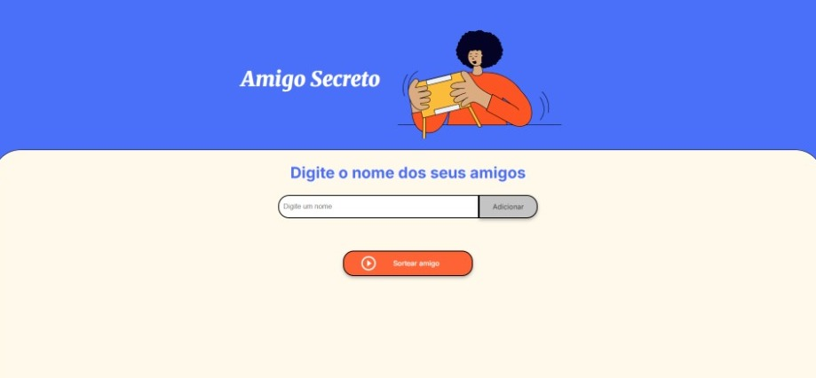
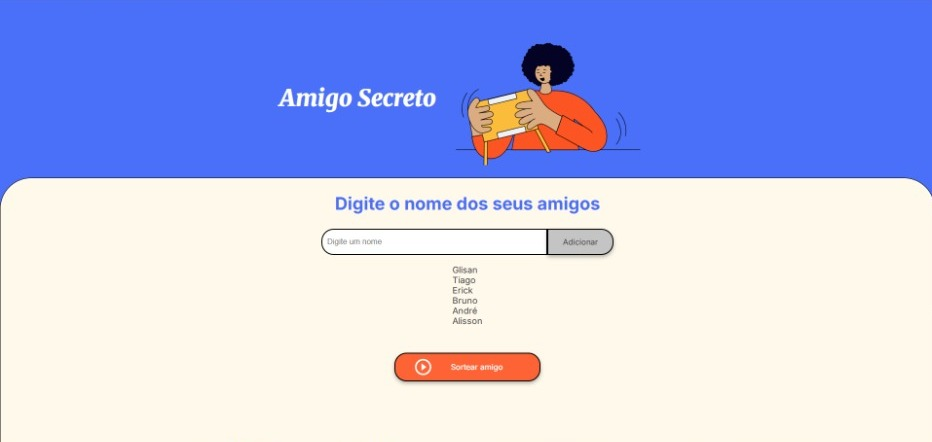
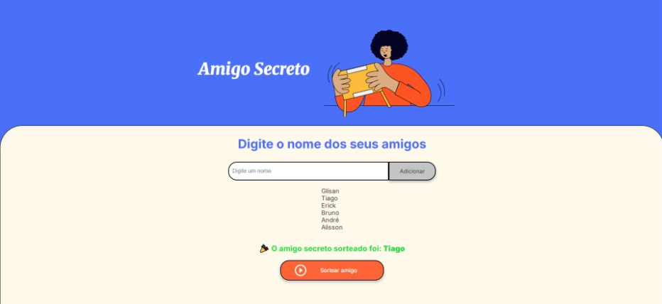

# 🎁 Amigo Secreto

Uma aplicação simples em **JavaScript, HTML e CSS** que permite criar uma lista de amigos e realizar um sorteio aleatório para descobrir quem será o **amigo secreto**.  

---

## 🚀 Funcionalidades  

- ➕ **Adicionar nomes** em uma lista.  
- ✅ **Validação** para impedir campos vazios.  
- 📜 **Visualização da lista** de amigos adicionados.  
- 🎲 **Sorteio aleatório** para escolher o amigo secreto.  

---

## 📸 Demonstração  

👉 Prints de tela da aplicação em funcionamento:  

### Tela inicial  
  

### Lista de amigos preenchida  
  

### Resultado do sorteio  

---

## 🛠️ Tecnologias utilizadas

  
  

